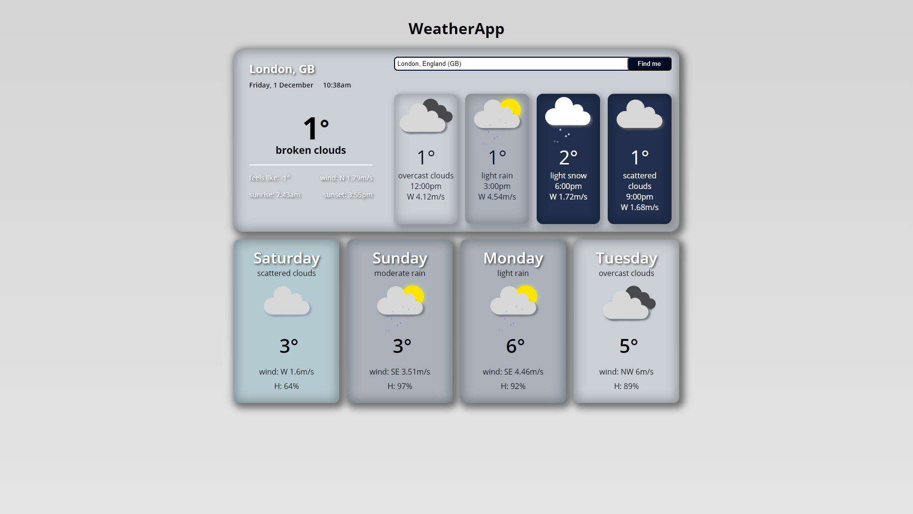

# WeatherApp

## Technologies: HTML, SASS, VanillaJS, Open weather API

## 🌐 Project

WeatherApp is a dynamic web application designed to provide real-time weather information using HTML, SASS, and JavaScript. This project is part of the Jump Digital School course, aimed at showcasing front-end development skills, particularly in creating custom animations and handling API data.

### 🏠 [Demo Link](https://weather-vanillajs-gustavopassarella.netlify.app/)



## ✨ Features

- **Current Weather Display:** Shows weather conditions for the current time.
- **Forecast Information:** Provides a forecast for 4 time stamps, 3 hours apart, on the current day and the next 4 days.
- **Search Functionality:** Users can search for weather information by city or location.
- **Geolocation Support**: If permitted, the application can automatically fetch weather data based on the user's current location.
- **Custom Weather Animations:** Unique animations corresponding to different weather conditions for enhanced user experience.
- **Mobile-First Design:** Optimized for mobile users, ensuring a responsive and intuitive interface on smaller screens.

## 🔧 Installation and Setup

Clone the repository

```
git clone https://github.com/Gunnar50/weatherapp-vanilla-javascript.git
```

Navigate to the project directory

```
cd weatherapp-vanilla-javascript
```

Open `index.html` as a Live Server

## 🧠 Reflection

This project was developed as a side project for the Jump Digital School Bootcamp to better understand frontend development, particularly in working with external APIs like the OpenWeather.

The goal was to build a user-friendly application where users can easily check the current weather and forecast for the next few days.

The project posed a series of challenges including:

- Deep understanding of JavaScript
- Performing API calls
- Implementing custom animations based on weather conditions
- Implementing mobile first approach

These challenges were significant in deepening my understanding of HTML, CSS and JavaScript and how different parts of an application interact with each other.

### 🛠️ Technology Stack

- Visual Studio Code
- HTML
- SASS
- JavaScript
- OpenWeather API

## 🤝 Contributing

Contribuition, issues and feature requests are welcome!

Feel free to check the [issues page](https://github.com/Gunnar50/react-simpsons-quotes/issues)

## ⭐️ Show your support

Give a start if you liked and this project helped you!

## 📝 License

This project is open source and available under the MIT License.
